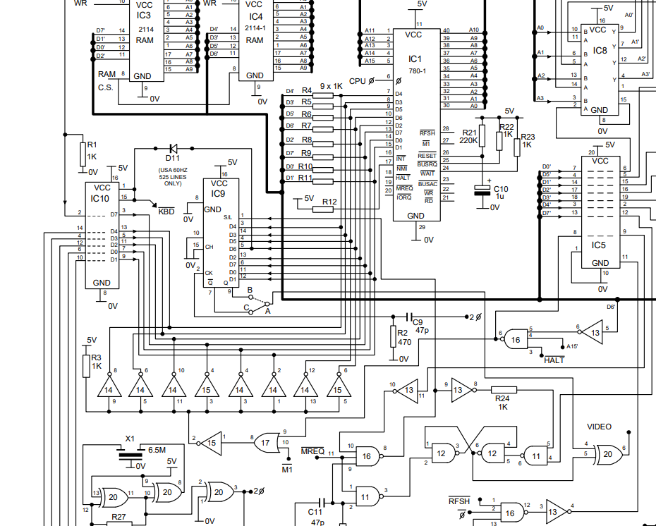
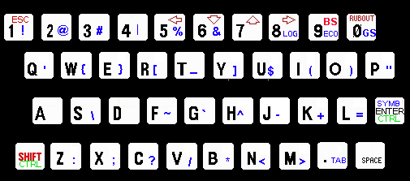

> **Integration note** (delete before pasting into the manual): this
> chapter assumes the reader already knows the SD81 Booster (hardware,
> installation, SD card) from earlier chapters, so it doesn't repeat
> that introduction. It fits naturally as a new chapter either after
> "11. Memory management" (shares the 8 KB block-paging concept) or at
> the end, alongside "15. For programmers" (same technical register).
> That chapter's "Writing (OUT 7FEFh)" section already documents the
> border-colour register cited below under BORDER — link to it instead
> of repeating it. Headings still need numbering and matching table-of-
> contents entries.

# CP/M — an alternative operating system

Besides the ZX81's built-in BASIC, the SD81 Booster can boot **CP/M**,
the standard operating system of professional 8-bit microcomputers
from the late 1970s and 1980s. Two ports exist for this hardware:

- **CP/M 2.2**, the classic version, with no memory banking: up to
  about 41 KB of TPA (transient program area) in MC45 mode.
- **CP/M 3 (CP/M Plus), banked**, which uses the SD81 Booster's memory
  paging to split RAM into independent 8 KB system and user banks.
  This is the one this chapter documents.

Compared with 2.2, CP/M 3 adds: more TPA (system and user no longer
share the same bank), a RAM disk, the real-time clock wired into file
timestamps, a 256-character colour console, and a network driver for
BBSes and WiFi communication software.

The system follows the Digital Research (DRI) standard as closely as
the hardware allows: the same CCP, BDOS and BIOS layout, the same
`.COM` program conventions, the same public BIOS jump table. What is
specific to this port is the memory-paging layer (the XIOS) and the
device drivers — disk, keyboard, console, clock and network — written
for the SD81 Booster hardware.

## CP/M 2.2: the two build modes

CP/M 2.2 ships in two variants, chosen at build time (`config.inc`),
depending on whether **MC45** mode is used:

| Mode | MC45 | TPA | Video RAM | Recommended for |
|---|---|---|---|---|
| 32 KB | No | ~24 KB | `$8000` | General CP/M use |
| 48 KB | Yes | ~41 KB | `$C000` | Turbo Pascal and large programs |

The 32 KB mode works on any SD81 Booster with nothing special to
enable. The 48 KB one needs MC45 turned on, and gives almost twice the
TPA — the difference between being able to compile with Turbo Pascal
or not.

### What MC45 is, and why it's needed

In its standard video mode, the ZX81 generates each horizontal screen
line by **literally executing the video buffer itself** as if it were
machine instructions: for the duration of that line, a circuit
replaces whatever is on the data bus with zeros, forcing `NOP` on
every cycle, until it reaches the end of the line — a genuine `HALT`
— which releases the generator and lets the CPU execute that `HALT`.



The circuit (IC15.2 in the ZX80 reference schematic) forces the data
bus to zero through eight open-collector NOT gates, active when all of
the following hold at once: `/HALT=0`, `/M1` (opcode-fetch cycle),
`A15=1` and `D6=0`. The condition on `D6` is what tells normal
characters (bit 6 clear, turned into `NOP`) apart from the end-of-line
`HALT` itself (opcode `$76` = `0111 0110`, bit 6 set) — so the circuit
knows when to stop without needing anything else.

That same mechanism, necessary for native video, is what prevents real
code from running in blocks 4 and 5 (addresses 32768-49151): any byte
with `D6=0` landing there during an opcode-fetch cycle turns into
`NOP`, whether or not it has anything to do with generating video.

**MC45 fools that circuit by forcing the `/HALT` signal low**
intermittently, during opcode-fetch cycles in the covered area. With
`/HALT` already low, the condition the circuit is watching for never
holds as it expects, and the code executes without anything being
substituted. It's safe because blocks 4/5 never coincide with the
shifted video buffer in normal use.

> **Warning.** Under normal conditions, `/HALT` is a signal driven by
> the Z80 itself, not the FPGA: with MC45 active, the FPGA drives it
> externally and intermittently during opcode-fetch cycles in the
> covered area. This shouldn't cause any problem, and the testing done
> so far — extensive — hasn't shown any. But there is no absolute
> guarantee that driving that signal this way, sustained over time,
> won't eventually cause some wear on it or on the FPGA pin that
> controls it. Using MC45 is done at the user's own responsibility.

### The extension to blocks 6 and 7

CP/M 3 needs **all** the memory above 32 KB for its bank paging, not
just blocks 4 and 5 — hence it uses an MC45 extension that also covers
blocks 6 and 7 (49152-65535), enabled by writing `170` to the
corresponding control register (`POKE 2062,170` from BASIC; CP/M 3's
own boot process does this on its own, with nothing for the user to
do).

This extension is only safe when nothing in the system is going to
execute the shifted video buffer while it's active, and CP/M 3
guarantees that by construction: it never generates native video that
way, so blocks 6/7 are free to run real code with no additional risk
beyond what MC45 itself already carries.

## Installation and boot

The system ships as a single file, `SYSTEM.BIN`, containing the BIOS,
BDOS and CCP already linked together. It loads from BASIC like any
machine-code block and starts with `USR`:

```
LOAD FAST "SYSTEM.BIN" CODE 24576
RAND USR 24576
```

Besides `SYSTEM.BIN`, the card needs the disk images: `A.IMG` through
`D.IMG` (256 KB of directory, 2 MB of data each) at the SD root. CP/M 3
images use their own format and are **not** compatible with CP/M 2.2
images or BASIC ones — they cannot be mixed. A fifth drive, `E:`, is a
RAM disk that needs no image: it is created empty on every boot and
its contents are lost on power-off or reset.

## Particularities of this CP/M

### Banked memory

The SD81 Booster pages memory in 8 blocks of 8 KB each. CP/M 3 uses
that to keep **two full contexts**: a system one (where the BIOS and
BDOS live) and a user one (the TPA, where programs run). The topmost
block (`$E000`-`$FFFF`) is common to both contexts — it holds
everything that must be reachable regardless of which context is
active, including the public BIOS jump table (see below).

This is only possible above 32 KB thanks to the MC45 extension to
blocks 6 and 7 — see "CP/M 2.2: the two build modes" above for the
full mechanism. CP/M 3 enables it only at boot, with no user
intervention.

A user program doesn't need to know any of this: the context switch is
handled by the system itself on every BDOS or BIOS call. It only
matters when writing code that touches memory outside the TPA, or that
needs to be faster than a normal BDOS call (see "Calling the BIOS
directly").

### Disks: `A:`-`D:` (SD card) and `E:` (RAM)

`A:` through `D:` are the four SD-backed drives, in standard CP/M 3
format (2 KB allocation blocks, 256 directory entries). `E:` is a
~390 KB RAM disk — fast but volatile, useful for compiler output,
scratch files, or anything that doesn't need to survive a reset.

`MOUNT3.COM` hot-swaps the image mounted on a drive without rebooting
the system — needed to change virtual floppies during a long session.

### Keyboard

The ZX81 has no full ASCII keyboard: it's missing symbols, and only
has one arrow key per `SHIFT` combination. The table below summarises
how each character is reached; see the "Keyboard table" appendix for
the complete listing.

- **Plain** and **`SHIFT`+key**: letters, digits, and the arrow keys
  (WordStar-style: `SHIFT`+5/6/7/8 = left/down/up/right).
- **`ENTER`+key**: the symbols the ZX81 has no dedicated key for,
  including the ones needed to program in C or use a BBS (`@ \ | ~ \``
  `_ # % & !`, among others).
- **`SHIFT`+`ENTER`, then a key**: control mode. Gives `^A`-`^Z` with
  letters, and `NUL` with the space bar.
- **`SHIFT`+9** and **`SHIFT`+0**: backspace (`BS`, `$08`) and delete
  (`DEL`, `$7F`) — both, because different remote software expects the
  same function on a different byte.
- **`SHIFT`+`.`**: tab (`TAB`, `$09`).

### Real-time clock

CP/M 3 stamps every file's creation/modification date and time using
the board's RTC. The clock itself is set through the SD81 Booster's
own RTC (from BASIC, or synced over NTP with a WiFi module) — CP/M
only reads whatever the RTC already holds.

### Console: 256-character colour terminal

The local console understands a subset of ANSI/VT100 sequences,
enough for BBSes, full-screen editors, and anything that paints with
colour:

- Cursor movement: `ESC[row;colH` (or `f`), `ESC[nA/B/C/D`
  (up/down/right/left), `ESC[s`/`ESC[u` (save/restore position).
- Erasing: `ESC[2J` (screen), `ESC[K` (end of line).
- Colour: `ESC[...m` (SGR) — see the `SGR` utility below for the
  supported code list.
- `ESC[6n` (cursor position report): genuinely answered, with
  `ESC[row;colR` — needed because some programs (BBSes included)
  measure the terminal's size this way before starting.
- 256 characters (the full CP437 set, not just printable ASCII).

### Calling the BIOS directly

Every BIOS function is reachable from a user program without going
through the BDOS, via a public jump table of 3 bytes per entry,
starting at address `$FF00`:

| Function | Index | Address |
|---|---|---|
| CONST | 2 | `$FF06` |
| CONIN | 3 | `$FF09` |
| CONOUT | 4 | `$FF0C` |
| AUXOUT | 6 | `$FF12` |
| AUXIN | 7 | `$FF15` |
| AUXIST | 18 | `$FF36` |
| AUXOST | 19 | `$FF39` |

(address = `$FF00 + index × 3`; the full 33-entry list follows the
standard CP/M 3 order.)

It's the same technique WordStar and Turbo Pascal use to avoid paying
the BDOS's cost on frequent console operations, meant for programs
that need the best possible performance — a communications terminal,
for instance. The `TERM` program included with the system (see below)
is a real example: it calls `CONOUT` this way, which multiplies
console throughput several times over compared with going through the
BDOS.

## Communications

The system includes a network driver (`NET`) that presents the Z80
with a raw byte stream, as if it had a modem attached — the software
itself decides what to do with that stream (for instance, sending `AT`
commands to dial a connection). The actual WiFi bridge is handled by
the board's ESP32 module; the Z80 knows nothing about sockets or
addresses.

### `TERM` — communications terminal

`TERM.COM` is the terminal included for using `NET`. Unlike a typical
CP/M program, it does **not** go through the logical device `AUX:` or
the BDOS: it talks to the network hardware directly, using the same
direct-BIOS-call trick described above for screen output. The reason
is performance — a generic terminal honouring `DEVICE AUX:` would be
several times slower — and it means `TERM` is built specifically for
`NET`, not as a stand-in for a general-purpose communications
terminal.

`TERM` keys (all with `ENTER`+key):

| Key | Function |
|---|---|
| `ENTER`+`0` | Exit |
| `ENTER`+`9` | Toggle local echo (see what you type as you type it) |
| `ENTER`+`8` | Toggle logging to a file (with `TERM file.BIN`) |

## Included utilities

| Program | Function |
|---|---|
| `MOUNT3.COM` | Hot-swaps the image mounted on a drive |
| `TERM.COM` | Communications terminal (see above) |
| `CLS.COM` | Clears the screen and homes the cursor |
| `SGR.COM` | Changes the console's ink/paper colour |
| `BORDER.COM` | Changes the border colour |

### `CLS`

No arguments. Clears the screen.

### `SGR`

```
SGR parameters
```

Sends the ANSI escape sequence `ESC[parameters m` to the console.
Parameters are separated by `;`, exactly like on any ANSI terminal:

| Code | Effect |
|---|---|
| `0` | Reset to the default colours |
| `1` | Bright ink |
| `30`-`37` | Ink colour: black, red, green, yellow, blue, magenta, cyan, white |
| `40`-`47` | Paper colour, same colour table |

Examples:

```
SGR 0            reset
SGR 33           yellow ink
SGR 1;33;44      bright yellow ink, blue paper
```

### `BORDER`

```
BORDER n
```

`n` from 0 to 7 for a normal colour, or 8 to 15 for the same colour
bright (same numbers as `SGR`, plus 8 for brightness). The border is
an FPGA register separate from the console — see "Writing (OUT
7FEFh)" in the programmers' chapter for the full port format.

```
BORDER 4     blue border
BORDER 12    bright blue border
```

## Appendix A: keyboard table



`ENTER`+`8` and `ENTER`+`9` are labelled by function (`LOG`, `ECO`)
rather than by the control code they send (`$1E`, `$1C`): they're the
ones `TERM` uses for its own menu, and nobody needs to remember the
ASCII name of those codes, only what they do here.

| Key | Plain | `SHIFT` | `ENTER` |
|---|---|---|---|
| 1 | `1` | `ESC` | `!` |
| 2 | `2` | — | `@` |
| 3 | `3` | — | `#` |
| 4 | `4` | — | `\|` |
| 5 | `5` | ← | `%` |
| 6 | `6` | ↓ | `&` |
| 7 | `7` | ↑ | — |
| 8 | `8` | → | — |
| 9 | `9` | `BS` | `^\` |
| 0 | `0` | `DEL` | `^]` |
| Q | q | Q | `'` |
| W | w | W | `{` |
| E | e | E | `}` |
| R | r | R | `[` |
| T | t | T | `_` |
| Y | y | Y | `]` |
| U | u | U | `$` |
| I | i | I | `(` |
| O | o | O | `)` |
| P | p | P | `"` |
| A | a | A | — |
| S | s | S | `\` |
| D | d | D | — |
| F | f | F | `~` |
| G | g | G | `` ` `` |
| H | h | H | `^` |
| J | j | J | `-` |
| K | k | K | `+` |
| L | l | L | `=` |
| Z | z | Z | `:` |
| X | x | X | `;` |
| C | c | C | `?` |
| V | v | V | `/` |
| B | b | B | `*` |
| N | n | N | `<` |
| M | m | M | `>` |
| `.` | `.` | `TAB` | `,` |
| SPACE | space | space | space |
| ENTER | `CR` | `CR` | `CR` |

Also, `SHIFT`+`ENTER` followed by a letter gives `^A`-`^Z` (letter
`AND $1F`), and `SHIFT`+`ENTER`+space gives `NUL`. `ENTER`+`0`/`9`/`8`
(`^]`, `^\`, `^^`) are reserved for `TERM` — see above.

## Appendix B: memory map (summary)

| Range | Contents |
|---|---|
| `$0000`-`$DFFF` | Banked: TPA (user context) or BIOS/BDOS/CCP (system context), depending on which is active |
| `$E000`-`$FFFF` | Common to both contexts: the SCB (`$FE00`), the public BIOS jump table (`$FF00`), and the rest of the state that must look the same from either side |

The exact TPA size depends on the final system build; it can be
checked by booting and reading CP/M 3's startup banner (`Banked
memory, NN.NK TPA`).
